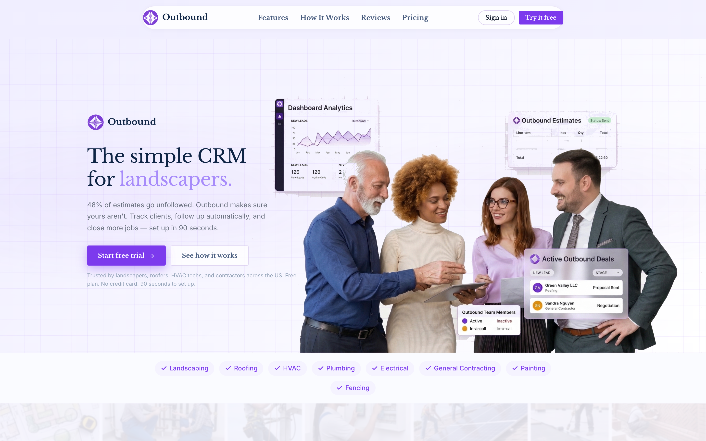
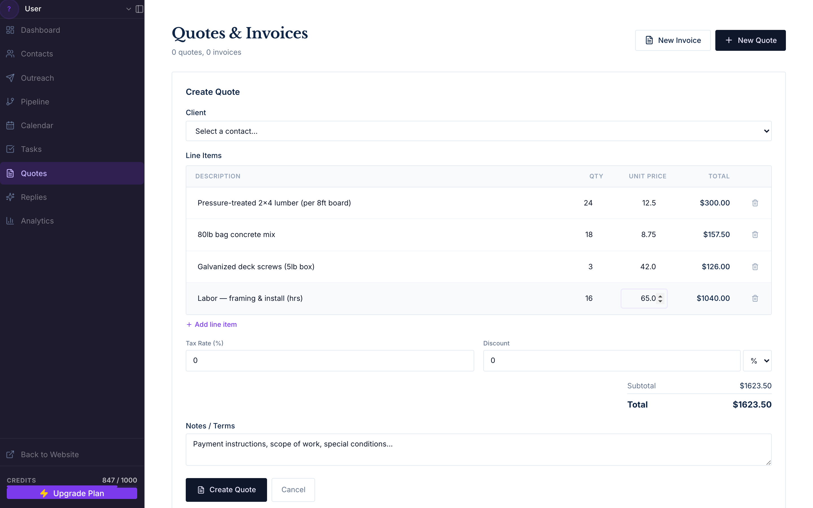
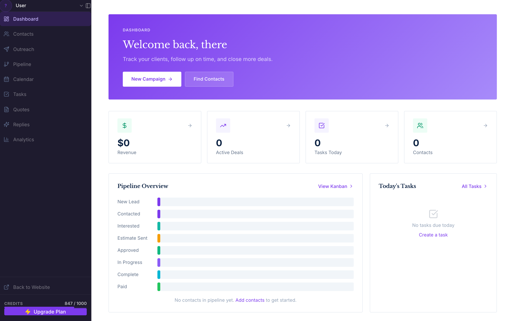

# Outbound

**Two-day Launchathon build.** A B2B outreach CRM and materials cost calculator for small trades businesses — landscapers, roofers, HVAC, plumbing, electrical, general contracting.



## What it does

Two features, one app.

### 1. Materials cost calculator

Build a quote line-item by line-item — lumber, concrete, hardware, labor hours — with live-computed totals, tax, and discount. Convert straight to an invoice; export a PDF.



### 2. Outreach CRM

Contacts, pipeline (New Lead → Contacted → Estimate Sent → Approved → In Progress → Paid), Gmail-connected outreach sequences, reply threading, tasks, and calendar sync.



## Stack

- **Frontend:** React 19, TypeScript, Vite 6, TanStack Query, React Router 7, Tailwind 4
- **Backend:** Flask 3.1 (Python), Gunicorn
- **Data & auth:** Firebase (Firestore + Google Sign-In)
- **Integrations:** Gmail API, Google Calendar, Anthropic Claude, OpenAI, ReportLab (PDFs)

## Run it

Prereqs: Node 20+, Python 3.11+, a Firebase project, and `.env` files in `backend/` and `frontend/` (Firebase keys, Gmail OAuth, LLM keys).

```bash
# Backend — http://localhost:5002
cd backend
python -m venv venv && source venv/bin/activate
pip install -r requirements.txt
python wsgi.py

# Frontend — http://localhost:5174
cd frontend
npm install
npm run dev
```

Open http://localhost:5174, sign in with Google, connect Gmail, and you're in.
